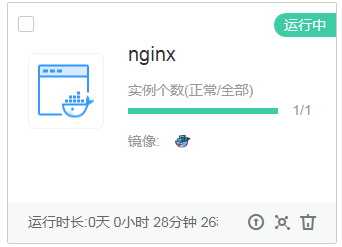

# 快速入门<a name="cci_02_0011"></a>

## 概述<a name="section142673304107"></a>

本文通过调用一系列云容器实例的API使用nginx镜像创建一个工作负载，介绍使用云容器实例API的基本流程。

其中，镜像直接使用Docker官方nginx镜像，容器的资源规格为0.25核CPU、512M内存，并绑定一个负载均衡实例，通过负载均衡实例从外网访问容器负载。

API的调用方法请参见[如何调用API](如何调用API.md)。

## 创建流程<a name="section114621034191316"></a>

1.  调用[创建Namespace](创建Namespace.md)接口创建命名空间。
2.  调用[创建Network](创建Network.md)接口创建网络，与VPC和子网关联。
3.  调用[创建Deployment](创建Deployment.md)接口创建nginx容器负载。

## 创建Nginx负载<a name="section680742610404"></a>

1.  调用[创建Namespace](创建Namespace.md)接口创建命名空间，并指定使用GPU型资源。

    ```
    {
        "apiVersion": "v1",
        "kind": "Namespace",
        "metadata": {
            "name": "namespace-test",
            "annotations": {
                "namespace.kubernetes.io/flavor": "gpu-accelerated"
            }
        },
        "spec": {
            "finalizers": [
                "kubernetes"
            ]
        }
    }
    ```

    您需要指定如下参数。

    -   name：命名空间的名称。
    -   namespace.kubernetes.io/flavor：命名空间的类型，当前支持GPU加速型（**gpu-accelerated**）和通用计算型（**general-computing**）。GPU加速型命名空间中可以使用GPU显卡。

2.  调用[创建Network](创建Network.md)接口创建网络，与VPC与子网关联。

    ```
    {
        "apiVersion": "networking.cci.io/v1beta1",
        "kind": "Network",
        "metadata": {
            "name": "test-network",
            "annotations": {
                "network.alpha.kubernetes.io/default-security-group": "security-group-id",
                "network.alpha.kubernetes.io/domain-id": "domain-id",
                "network.alpha.kubernetes.io/project-id": "project-id"
            }
        },
        "spec": {
            "availableZone": "cnnorth1a",
            "cidr": "192.168.0.0/24",
            "attachedVPC": "vpc-id",
            "networkID": "network-id",
            "subnetID": "subnet-id",
            "networkType": "underlay_neutron"
        }
    }
    ```

    您需要指定如下参数。

    -   name：网络对象的名称。
    -   network.alpha.kubernetes.io/default-security-group：安全组ID，您可以在[安全组控制台](https://console.huaweicloud.com/vpc/#/vpc/vpcmanager/securitygroups)查看。
    -   network.alpha.kubernetes.io/domain-id：账号ID，获取方法请参见[获取账号ID](获取账号ID.md)。
    -   network.alpha.kubernetes.io/project-id：项目ID，获取方法请参见[获取项目ID](获取项目ID.md)。
    -   availableZone：服务所在区域的可用区，您可以在[地区与终端节点](https://developer.huaweicloud.com/endpoint)查询，例如“cn-north-1a“，表示“华北-北京一“的“可用区一“。
    -   cidr：网段地址，虚拟私有云下可用子网的范围。
    -   attachedVPC：命名空间所在VPC（虚拟私有云）的ID，您可以在[虚拟私有云控制台](https://console.huaweicloud.com/vpc/#/vpc/vpcmanager/vpcs)中查询，也可以通过[查询VPC列表](https://support.huaweicloud.com/api-vpc/vpc_api01_0003.html)API查询。
    -   networkID：VPC内子网的网络ID，您可以在[虚拟私有云控制台](https://console.huaweicloud.com/vpc/#/vpc/vpcmanager/vpcs)中查询，也可以通过[查询子网列表](https://support.huaweicloud.com/api-vpc/vpc_subnet01_0003.html)API查询。
    -   subnetID：VPC内子网的ID，您可以在[虚拟私有云控制台](https://console.huaweicloud.com/vpc/#/vpc/vpcmanager/vpcs)中查询，也可以通过[查询子网列表](https://support.huaweicloud.com/api-vpc/vpc_subnet01_0003.html)API查询。

3.  调用[创建Deployment](创建Deployment.md)接口创建nginx容器负载。

    负载名称为nginx，使用Docker官方镜像nginx:latest，容器的资源规格为0.25核CPU、1G内存。调用接口后，云容器实例会创建一个运行nginx的容器。

    ```
    {
        "apiVersion": "apps/v1",
        "kind": "Deployment",
        "metadata": {
            "name": "nginx"
        },
        "spec": {
            "replicas": 1,
            "selector": {
                "matchLabels": {
                    "app": "nginx"
                }
            },
            "template": {
                "metadata": {
                    "labels": {
                        "app": "nginx"
                    }
                },
                "spec": {
                    "containers": [
                        {
                            "image": "nginx:latest",
                            "resources": {
                                "limits": {
                                    "cpu": "250m",
                                    "memory": "1Gi"
                                },
                                "requests": {
                                    "cpu": "250m",
                                    "memory": "1Gi"
                                }
                            }
                        }
                    ],
                    "imagePullSecrets": [
                        {
                            "name": "imagepull-secret"
                        }
                    ]
                }
            }
        }
    }
    ```

    您需要指定如下参数。

    -   name：Deployment的名称。
    -   replicas：Pod的数量，即Deployment下有几个Pod。
    -   selector.matchLabels：Deployment使用哪些标签选择Pod，例如这里设置的标签app=nginx，当Pod有这个标签时，就会被Deployment选中管理。
    -   template：Pod的模板，定义Pod的各种配置和规格。
        -   metadata.labels：Pod的标签。
        -   spec.containers：Pod中容器的定义。
            -   image：创建容器使用的镜像。
            -   resources.limits：容器使用资源的大小限制，即容器使用的资源不能超过这个限制。
            -   resources.requests：容器申请使用资源的大小。


    Nginx负载创建完后，您可以在[云容器实例控制台](https://console.huaweicloud.com/cci/#/app/dashboard)查看到负载。

    **图 1**  nginx<a name="fig47489333115"></a>  
    


