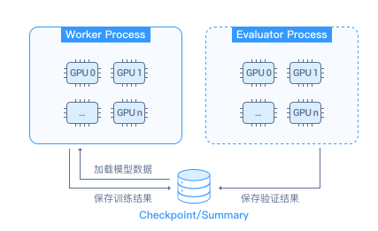
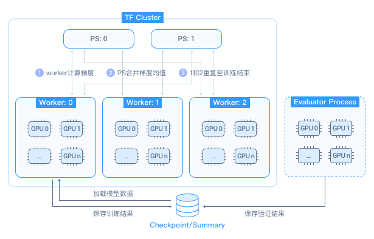
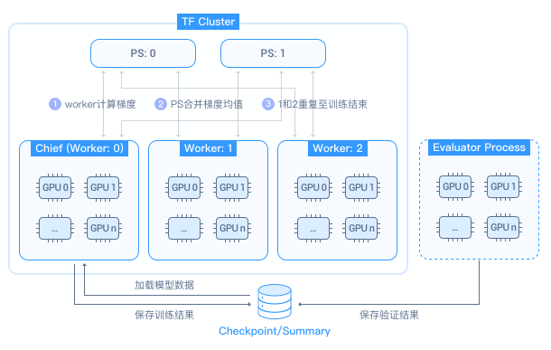
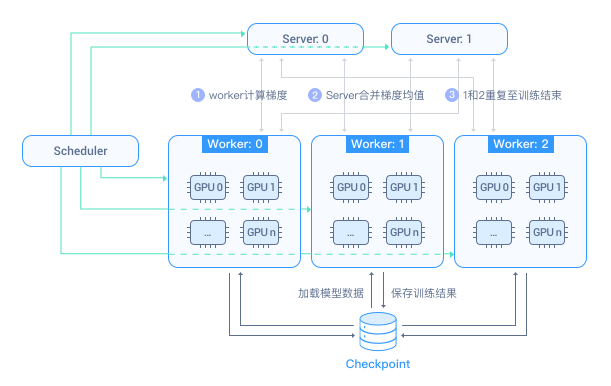
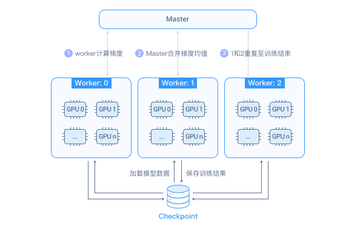
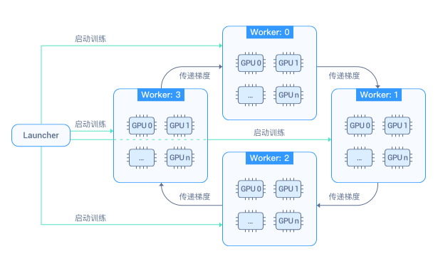

# AI容器基本概念

AI容器面向云端深度学习训练和推理场景，支持Tensorflow、MXNet、PyTorch、MPI主流训练框架，兼容Kubeflow生态，提供基于NVIDIA Tesla V100 GPU、Mellanox InfiniBand 100G网卡等高性能硬件的算力。

AI容器提供了多种类型的AI任务部署和管理能力，支持任务部署、配置、监控、日志等特性。AI容器支持任务类型包括Tensorflow、MXNet、PyTorch、MPI。

## Tensorflow

Tensorflow任务是基于Tensorflow开源框架的kubernetes自定义资源类型，有多种角色可以配置，能够帮助我们更简单地实现Tensorflow的单机或分布式训练。Tensorflow开源框架的信息详见：[https://www.tensorflow.org](https://www.tensorflow.org/)  。

Tensorflow训练模式：

1.  **Worker（+ Evaluator）**：单节点进行训练，只有Worker角色，可以搭配Evaluator角色使用。

1.  **PS + Worker（+ Evaluator）**：多节点进行训练，有PS和Worker角色，可以搭配Evaluator角色使用。

    

2.  **PS+ Chief+ Worker（+ Evaluator）**：多节点进行训练，有PS、Chief和Worker角色，可以搭配Evaluator角色使用。

    

-   **Worker**负责做集中计算，会计算神经网络的Loss，并且准确计算梯度。
-   **Evaluator**不属于TF Cluster，负责分布式验证训练模型的性能，导出训练模型到外部存储。
-   **PS**（Parameter Server）是参数服务器，负责保存和更新所有模型的状态，也就是参数，并根据后面的梯度下降进行更新参数。
-   **Chief**是一个特殊的Worker，只能有一个。除了Worker的功能外，Chief还额外负责：checkpoint保存，checkpoint恢复，保存用于Tensorboard的summary。

## MXNet

MXNet任务是基于MXNet开源框架的kubernetes自定义资源类型，有多种角色可以配置，能够帮助我们更简单地实现MXNet的训练。MXNet开源框架的信息详见：[https://mxnet.incubator.apache.org/](https://mxnet.incubator.apache.org/)。

MXNet训练模式：**Scheduler + Server+ Worker**，多节点进行训练，有Scheduler、Server和Worker角色。

-   **Scheduler**是一个调度器，在集群中负责调度的角色。主要包含：等待各个node节点数据的上报并让各个node节点知道彼此的存在并互相通讯。
-   **Server**是参数服务器，负责保存和更新所有模型的参数，并与Worker进行通讯，根据梯度下降更新参数。
-   **Worker**负责做集中计算，会计算神经网络的Loss，并且准确计算梯度。

## PyTorch

PyTorch任务是基于PyTorch开源框架的kubernetes自定义资源类型，有多种角色可以配置，能够帮助我们更简单地实现PyTorch的训练。PyTorch开源框架的信息详见：[https://pytorch.org/](https://pytorch.org/)。

PyTorch训练模式：**Master+ Worker**，多节点进行训练，有Master和Worker角色。

-   **Master**是参数服务器，负责保存和更新所有模型的参数，并与Worker进行通讯，根据梯度下降更新参数。
-   **Worker**负责做集中计算，会计算神经网络的Loss，并且准确计算梯度。

## MPI

MPI分布式任务是基于allreduce架构的kubernetes自定义资源类型，能够帮助我们更简单地实现allreduce的分布式训练。MPI开源框架的信息详见：[https://www.open-mpi.org/](https://www.open-mpi.org/)。

MPI训练模式：**Launcher+ Worker**，多节点进行训练，有Launcher和Worker角色。

-   **Launcher**负责把Worker的拓扑信息同步到每个Worker，负责通过kubectl exec远程启动Worker的训练进程。
-   **Worker**负责做集中计算，会计算神经网络的Loss，并且准确计算梯度。

