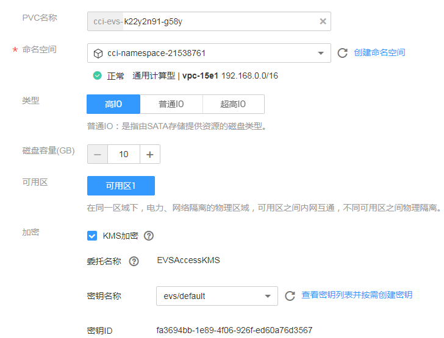

# 云硬盘存储卷

为满足数据的持久化需求，云容器实例支持将[云硬盘](https://www.huaweicloud.com/product/evs.html)（EVS）挂载到容器中。通过云硬盘，可以将存储系统的远端文件目录挂载到容器中，数据卷中的数据将被永久保存，即使删除了容器，只是删除了挂载数据卷，数据卷中的数据依然保存在存储系统中。

EVS目前支持普通I/O、高I/O、超高I/O三种规格。

-   普通I/O：后端存储由SATA存储介质提供，适用于大容量，读写速率要求不高，事务性处理较少的应用场景，如：开发测试、企业办公应用。
-   高I/O：后端存储由SAS存储介质提供，适用于性能相对较高，读写速率要求高，有实时数据存储需求应用场景，如：创建文件系统、分布式文件共享。
-   超高I/O：后端存储SSD存储介质提供，适用于高性能、高读写速率要求、数据密集型应用场景，如：NoSQL、关系型数据库、数据仓库（如Oracle RAC、SAP HANA\)。

## 使用限制

-   云容器实例无法导入以下条件的磁盘：非当前可用区、状态非可用、系统盘、被CCE关联、非SCSI盘、非共享盘、专属存储、冻结盘、HANA服务器专属类型盘（高IO性能优化型/超高IO时延优化型）。
-   云硬盘存储卷只能当一个新盘来用。对于云容器实例没有挂载过的云硬盘存储卷，云硬盘存储卷中的内容对容器不可见。
-   对于已导入的云硬盘，如果在云硬盘控制台中删除该硬盘，云容器实例无法感知，建议您确定没有负载使用时再删除云硬盘。
-   一个云硬盘存储卷只能挂载到一个实例下，否则会存在数据丢失的情况。

## 添加云硬盘

1.  登录云容器实例控制台，单击左侧导航栏的[存储管理 \> 云硬盘存储卷](https://console.huaweicloud.com/cci/#/app/storage/evs/list)。
    -   如果您在[云硬盘](https://www.huaweicloud.com/product/evs.html)中购买了云硬盘，可以这里导入后使用，请执行[2](#li195811391189)。
    -   如果您还没购买云硬盘存储卷，可以直接在这里购买，请执行[3](#li14431436407)。

2.  单击“导入“，进入“导入云硬盘“页面，选择需要导入的云硬盘，然后单击“导入“。

    > **说明：**   
    >一块云硬盘只能导入一个命名空间，不能同时导入多个命名空间。如果一块云硬盘已经被导入到一个命名空间，则在其他命名空间下不可见，不能再次导入。**如果需要导入已经格式化文件系统（ext4）的EVS磁盘，需要确保磁盘没有设置分区，否则可能存在数据丢失的情况。**  

    导入后，您可以在看到对应的卷。

    **图 1**  导入结果  
    

3.  单击“购买云硬盘存储卷“，填写相关参数，然后单击“立即购买“，确认规格后单击“提交“。

    

    -   PVC名称：PVC名称。
    -   命名空间：PVC所在命名空间。
    -   类型：磁盘的类型，可以选择高IO、普通IO和超高IO。
    -   磁盘容量：范围为\[10, 1000\]GB。
    -   可用区：选择磁盘所在的可用区。
    -   加密：“KMS加密“默认不勾选。勾选“KMS加密“后，若未创建委托请单击“创建委托“，并配置如下参数。

        > **说明：**   
        >目前“华东-上海一”区域暂不支持“加密”功能。  

        -   委托名称：委托表示委托方通过创建信任关系，给被委托方授予访问其资源的权限。当“委托名称”为“EVSAccessKMS”时，表示已经成功授权访问EVS访问KMS，授权成功后，EVS可以获取KMS密钥用来加解密云硬盘系统。
        -   密钥名称：密钥是一种用于存储应用所需要认证信息、密钥的敏感信息等的资源类型，内容由用户决定。资源创建完成后，可在容器应用中加载使用。如何创建密钥请参见[创建密钥](https://support.huaweicloud.com/usermanual-dew/dew_01_0178.html)。
        -   密钥ID：默认生成。

## 使用云硬盘

在[创建负载](无状态负载（Deployment）.md)的过程中，在添加容器后，展开“高级设置 \> 存储“，选择“云硬盘存储卷“，单击“添加云硬盘存储卷“。

**图 2**  配置云硬盘存储卷参数  

> **说明：**   
>当前云硬盘存储卷仅支持挂载单Pod。  

负载创建成功后，可以在“存储管理  \>  云硬盘存储卷“中查看到云硬盘与负载的关系。

**图 3**  管理云硬盘存储卷  

## 使用kubectl创建云硬盘存储卷

使用kubectl创建云硬盘存储卷请参见[使用PersistentVolumeClaim申请持久化存储](https://support.huaweicloud.com/devg-cci/cci_05_0014.html)。

