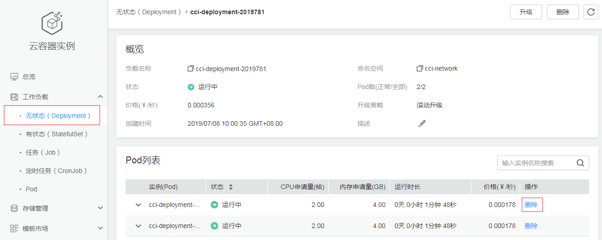

# 修复Linux内核SACK漏洞公告

华为云CCI团队已经于7月11日0点修复[Linux内核SACK漏洞](https://www.huaweicloud.com/notice/2018/20190619122553544.html)。

-   未关联ELB、EIP的容器实例，因为不对公网暴露，不受该漏洞影响，无需处理。

-   无状态负载（Deployment）：漏洞修复之后（7月11日0点之后）创建的无状态负载，不受该漏洞影响；漏洞修复之前（7月11日0点之前）创建的无状态负载，建议选择业务不受影响的时间窗口，[删除并重新创建负载的Pod实例](#section1446470135915)。
-   任务（Job）/定时任务（CronJob）：当前任务/定时任务执行完成后，下次任务/定时任务新建的Pod不再受该漏洞影响，无需处理。
-   插件：coredns插件不受该漏洞影响，无需处理。

## 漏洞详情

2019年6月18日，Redhat发布安全公告，Linux内核处理器TCP SACK模块存在3个安全漏洞\(CVE-2019-11477、CVE-2019-11478、CVE-2019-11479\)，这些漏洞与最大分段大小（MSS）和TCP选择性确认（SACK）功能相关，攻击者可远程发送特殊构造的攻击包造成拒绝服务攻击，导致服务器不可用或崩溃。

参考链接：

[https://www.suse.com/support/kb/doc/?id=7023928](https://www.suse.com/support/kb/doc/?id=7023928)

[https://access.redhat.com/security/vulnerabilities/tcpsack](https://access.redhat.com/security/vulnerabilities/tcpsack)

[https://www.debian.org/lts/security/2019/dla-1823](https://www.debian.org/lts/security/2019/dla-1823)

[https://wiki.ubuntu.com/SecurityTeam/KnowledgeBase/SACKPanic?](https://wiki.ubuntu.com/SecurityTeam/KnowledgeBase/SACKPanic?)

[https://lists.centos.org/pipermail/centos-announce/2019-June/023332.html](https://lists.centos.org/pipermail/centos-announce/2019-June/023332.html)

[https://github.com/Netflix/security-bulletins/blob/master/advisories/third-party/2019-001.md](https://github.com/Netflix/security-bulletins/blob/master/advisories/third-party/2019-001.md)

**表 1**  漏洞信息

<table><thead align="left"><tr id="row065718811595"><th class="cellrowborder" valign="top" width="25%" id="mcps1.2.5.1.1">
漏洞类型

</th>
<th class="cellrowborder" valign="top" width="25%" id="mcps1.2.5.1.2">
CVE-ID

</th>
<th class="cellrowborder" valign="top" width="25%" id="mcps1.2.5.1.3">
披露/发现时间

</th>
<th class="cellrowborder" valign="top" width="25%" id="mcps1.2.5.1.4">
华为云修复时间

</th>
</tr>
</thead>
<tbody><tr id="row1120510564498"><td class="cellrowborder" valign="top" width="25%" headers="mcps1.2.5.1.1 ">
输入验证错误

</td>
<td class="cellrowborder" valign="top" width="25%" headers="mcps1.2.5.1.2 ">
<a href="https://cve.mitre.org/cgi-bin/cvename.cgi?name=CVE-2019-11477" target="_blank" rel="noopener noreferrer">CVE-2019-11477</a>

</td>
<td class="cellrowborder" valign="top" width="25%" headers="mcps1.2.5.1.3 ">
2019-06-17

</td>
<td class="cellrowborder" valign="top" width="25%" headers="mcps1.2.5.1.4 ">
2019-07-11

</td>
</tr>
<tr id="row1056225316496"><td class="cellrowborder" valign="top" width="25%" headers="mcps1.2.5.1.1 ">
资源管理错误

</td>
<td class="cellrowborder" valign="top" width="25%" headers="mcps1.2.5.1.2 ">
<a href="https://cve.mitre.org/cgi-bin/cvename.cgi?name=CVE-2019-11478" target="_blank" rel="noopener noreferrer">CVE-2019-11478</a>

</td>
<td class="cellrowborder" valign="top" width="25%" headers="mcps1.2.5.1.3 ">
2019-06-17

</td>
<td class="cellrowborder" valign="top" width="25%" headers="mcps1.2.5.1.4 ">
2019-07-11

</td>
</tr>
<tr id="row19657198185917"><td class="cellrowborder" valign="top" width="25%" headers="mcps1.2.5.1.1 ">
资源管理错误

</td>
<td class="cellrowborder" valign="top" width="25%" headers="mcps1.2.5.1.2 ">
<a href="https://cve.mitre.org/cgi-bin/cvename.cgi?name=CVE-2019-11479" target="_blank" rel="noopener noreferrer">CVE-2019-11479</a>

</td>
<td class="cellrowborder" valign="top" width="25%" headers="mcps1.2.5.1.3 ">
2019-06-17

</td>
<td class="cellrowborder" valign="top" width="25%" headers="mcps1.2.5.1.4 ">
2019-07-11

</td>
</tr>
</tbody>
</table>

## 影响范围

影响Linux 内核2.6.29及以上版本。

## 解决方法

7月11日0点修复之前创建的无状态负载，建议选择业务不受影响的时间窗口，[删除并重新创建负载的Pod实例](#section1446470135915)。

1.  登录云容器实例管理控制台，左侧导航栏中选择[工作负载 \> 无状态（Deployment）](https://console.huaweicloud.com/cci/?#/app/workload/deployment/list)，单击负载名称。
2.  在无状态负载详情页面的Pod列表，单击Pod后的“删除”，在弹出的对话框中单击“是”。

    **图 1**  删除相关Pod  
    

    Pod删除后，Deployment会控制自动创建一个新的Pod，不需要您再进行新建，如[图2](#fig18810183164014)所示。

    **图 2**  自动创建Pod  
    

    > **须知：**   
    >存在多个Pod时，请逐个删除Pod，待前一个Pod重新创建成功后，再删除下一个Pod，避免业务发生中断。  

## 附：TCP SACK介绍

TCP是面向连接的协议。当双方希望通过TCP连接进行通信时，他们通过TCP握手交换某些信息建立连接，例如发起一个TCP请求，通过SYN发送初始序列ID、确认ID、连接使用的最大数据包段大小（MSS）、认证信息和处理选择性确认（SACK）等。整体TCP连接通过我们熟知的三次握手最终建立。

TCP通过一个数据段单元发送和接收用户数据包。 TCP数据段由TCP头、选项和用户数据组成。每个TCP段都有序列号（SEQ）和确认号（ACK）。

接收方通过SEQ号和ACK号来跟踪成功接收了哪些段。ACK号下一个预期接受的段。

**示例：**

上图中用户A通过13个100字节的段发送1k字节的数据，每个段具有20字节的TCP头，总计是13个段。在接收端，用户B接收了段1,2,4,6,8-13，而段3,5和7丢失，B没有接收到。

通过使用ACK号，用户B告诉A，他需要段3，用户A读取到B接收到2后没有收到3，A将重新发送全部段，尽管B已经收到了4,6和8-13段。这就导致了网络的低效使用。

