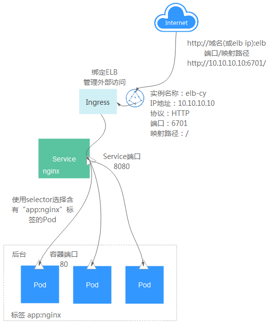

# 公网访问

公网访问是指使用外部网络访问负载，您可以给负载绑定增强型ELB实例（ELB必须与负载在同一个VPC内），通过ELB实例访问负载。

从公网访问负载需要给负载绑定ELB实例，当前外部访问支持四层和七层负载公网访问。

-   四层公网访问支持TCP和UDP两种协议，设置完成后可以通过“elb公网ip:elb端口“访问负载。
-   七层公网访问支持HTTP和HTTPS两种协议访问，设置完成后，可以通过“http://公网域名\(或elb 公网ip\):elb端口/映射路径“访问负载。

下图是一个通过HTTP协议访问负载的示例。

**图 1**  公网访问  

## 配置公网访问

在云容器实例中，您只需要在创建负载时选择“公网访问“，然后配置如下参数。

> **说明：**   
>如果您选择了公网访问且没有安装coredns插件，那么在创建负载时，云容器实例会为您自动安装coredns插件并收取费用。coredns插件的详细信息请参见[插件管理](插件管理.md)。  

-   负载域名：访问负载的域名。

-   ELB实例：选择ELB实例，如没有ELB实例可以单击“新建增强型ELB实例“创建。

    > **注意：**   
    >此处创建的ELB需要与负载所在命名空间在同一个VPC内。  

-   ELB协议：即公网访问使用的通信协议，支持HTTP、HTTPS、TCP和UDP协议。
-   公网域名（选择HTTP/HTTPS协议时可配置）：通过域名访问负载，公网域名需要您自行购买，并将域名解析指向所选的ELB实例弹性公网IP。
-   证书（选择HTTPS协议时必填）：SSL证书的导入方法请参见[SSL证书](SSL证书.md)。
-   ELB端口：选择使用的ELB访问的具体协议和端口。
-   负载端口协议：访问负载的通信协议，可选择TCP或UDP，如果ELB协议选择为HTTP/HTTPS，则负载端口协议为TCP。
-   负载端口配置：
    -   负载访问端口：负载提供的访问端口。
    -   容器端口：容器监听的端口，负载访问端口映射到容器端口。

-   HTTP路由配置
    -   映射路径：URL访问的路径，必须以“/“开头，如“/api/web“，也可以是根路径“/“。
    -   负载访问端口：前面设置的负载访问端口。

如下图所示，假如ELB实例的IP地址为“10.10.10.10“，则通过“http://10.10.10.10:6071/“就可以从公网访问到负载。

**图 2**  配置公网访问参数  

## 如何处理公网无法访问

1.  公网能正常访问的前提是负载已处于运行中状态，如果您的负载处于未就绪或异常状态，公网访问将无法正常使用。
2.  从负载开始创建到公网可以正常访问可需要1分钟到3分钟的时间，在此时间内网络路由尚未完成配置，请稍作等待。
3.  负载创建3分钟以后仍然无法访问。在“工作负载 -\> 查看您创建的负载详情-\> 选择访问配置 -\> 选择访问事件“，查看访问事件，查看是否有告警事件。如下两种常见的事件。
    -   Listener port is repeated：ELB监听器端口重复，是由于之前发布公网访问的负载，删除之后立刻创建使用相同ELB端口的公网访问负载，ELB实际删除端口需要一定的时间，因此首次创建失败，可以选择删除负载重新创建，也可以等待5-10分钟，公网访问可正常使用。
    -   Create listener failed：创建ELB监听器失败，创建监听器失败的原因一般是超过配额限度，请选择其他配额充足的ELB实例。

4.  负载创建3分钟以后仍然无法访问，且无告警事件，可能原因是用户配置的容器端口实际上没有相应进程在监听，目前云容器实例服务无法检测出该类使用异常，需要您排查镜像是否有监听该容器端口。如果容器端口监听正确，此时无法访问的原因可能为ELB实例本身有问题，请排查ELB实例状态。

