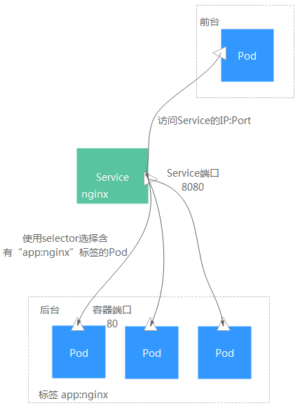
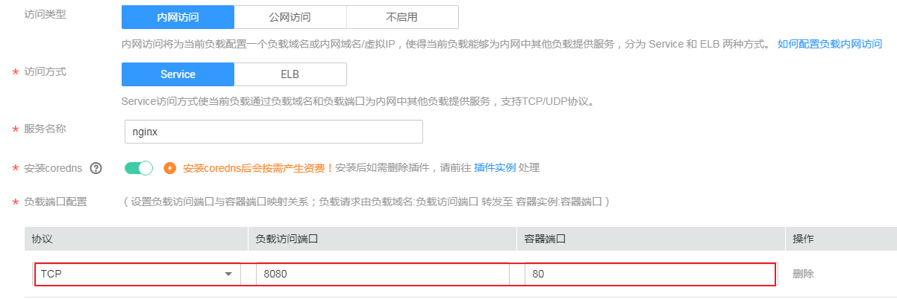

# 内网访问

内网访问有如下两种情况：

-   [使用Service方式访问](#section7148214124710)：该方式适合CCI中同一个命名空间中的负载相互访问。
-   [使用私网ELB访问](#section154315254491)：该方式适合华为云内部资源（云容器实例以外的资源，如ECS等）且与负载在同一个VPC内互相访问，另外在同一个VPC不同命名空间的负载也可以选择此种方式。通过内网域名或ELB的“IP:Port“为内网提供服务，支持HTTP/HTTPS和TCP/UDP协议。如果是华为云内部且与负载在不在同一个VPC内，也可以选择创建VPC[对等连接](https://support.huaweicloud.com/usermanual-vpc/zh-cn_topic_0046655036.html)，使得两个VPC之间网络互通。

## 使用Service方式访问

负载中最小的资源单位就是Pod，访问负载就是访问负载中的Pod。负载中的Pod能够动态地创建和销毁，例如，扩缩容或者执行滚动升级，这时Pod的地址会发生变化，这为访问Pod带来了不便。

为解决该问题，云容器实例提供了coredns（内部域名解析）插件，Pod的变化由负载管理，外部无需感知。

访问负载只需要通过“服务名称:负载访问端口“即可，其中负载访问端口映射到容器端口。如下图所示，前台中的Pod如果要访问后台中的Pod时，只需要访问“nginx:8080“即可。

**图 1**  使用Service方式访问  

在云容器实例中，您只需要在创建负载时，填写服务名称和负载的端口配置，即可通过“服务名称:负载访问端口“访问到该负载。

-   服务名称：服务名称即Service的名称，Service是用于管理Pod访问的对象。Service的详细信息请参见[https://support.huaweicloud.com/devg-cci/cci\_05\_0007.html](https://support.huaweicloud.com/devg-cci/cci_05_0007.html)。
-   安装coredns：coredns插件为您的其他负载提供内部域名解析服务，如果不安装coredns则无法通过“服务名称:负载访问端口“访问负载。
-   负载端口配置
    -   协议：访问负载的通信协议，可选择TCP或UDP。
    -   负载访问端口：负载提供的访问端口。
    -   容器端口：容器监听的端口，负载访问端口映射到容器端口。

**图 2**  配置Service访问参数  

## 使用kubectl创建Service

使用kubectl创建Service请参见[Service](https://support.huaweicloud.com/devg-cci/cci_05_0007.html)。

## 使用私网ELB访问

如果需要从负载所在命名空间之外（华为云其他资源、云容器实例其他命名空间的负载）访问负载，可以通过绑定私网类型的增强型ELB实例（即创建ELB时类型选择私网），通过私网ELB的VIP访问负载。

此时需要选择私网ELB实例，其余配置方法与[公网访问](公网访问.md)完全一致。

**图 3**  使用内网ELB访问  

