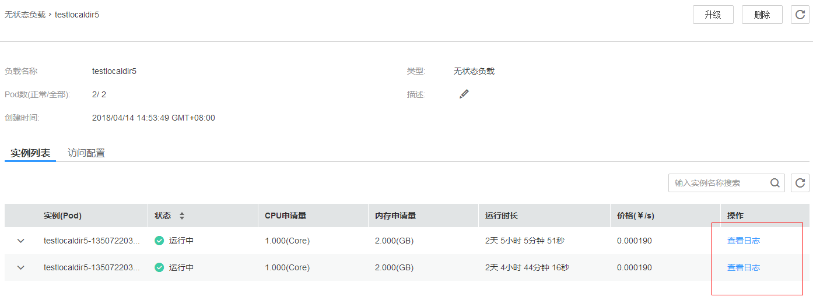

# 日志管理

云容器实例支持挂载日志存储卷采集日志，您只需要在[创建负载](无状态负载（Deployment）.md)的时候添加日志存储卷，即可将日志写入到日志存储卷中。

云容器实例对接了[应用运维管理（Application Operations Management，AOM）](https://www.huaweicloud.com/product/aom.html)服务，AOM会采集日志存储中的“.log“等格式日志文件，转储到AOM中，方便您查看和检索。

## 添加日志存储

在[创建负载](无状态负载（Deployment）.md)的时候设置为容器添加日志存储。

-   容器内日志路径：即日志存储挂载到容器内的挂载路径，需要保证应用程序的日志输出路径与该路径一致，这样日志才能写入到日志存储卷中。

    > **须知：**   
    >1.  日志存储卷挂载后，会覆盖掉日志路径下已有的内容。请保证日志路径为一个独立的路径，否则原来的内容不可见。  
    >2.  AOM只采集日志路径下的“.log“、“.trace“、“.out“日志文件。  
    >3.  AOM最能多只能采集20个日志文件，也就是说您的日志最多只能输出到日志路径下的20个文件中，否则不能转储到AOM中。  
    >4.  AOM每分钟扫描一次日志文件，当某个日志文件超过50MB时，会立即对其转储（转储时会在该日志文件所在的目录下生成一个新的zip文件。对于一个日志文件，AOM只保留最近生成的20个zip文件，当zip文件超过20个时，时间较早的zip文件会被删除），转储完成后AOM会将该日志文件清空。  

-   日志存储空间：日志的存储空间大小。

    > **须知：**   
    >每个租户一个月有500M的免费日志存储空间，超过500M时AOM将根据实际使用量进行收费，计费规则请参见[产品价格详情](https://www.huaweicloud.com/pricing.html?tab=detail#/aom)。  

**图 1**  使用日志存储  

## 查看日志

负载创建完成后，您可以查看容器日志。

单击已创建的负载，在容器实例所在行，单击“查看日志“。

**图 2**  查看日志  

在AOM界面中即可查看对应容器的日志，AOM中日志查询方法请参见[查看日志文件](https://support.huaweicloud.com/usermanual-aom/aom_02_0010.html)。

