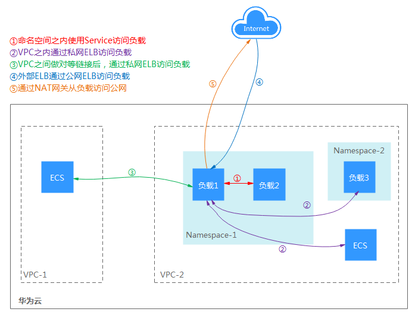

# 网络访问概述

负载访问可以分为如下几种场景：

-   [内网访问](内网访问.md)：访问华为云内网资源。
    -   使用“Service“方式访问：该方式适合CCI中同一个命名空间中的负载相互访问。
    -   使用ELB（私网）访问：该方式适合华为云内部资源（云容器实例以外的资源，如ECS等）且与负载在同一个VPC内互相访问，另外在同一个VPC不同命名空间的负载也可以选择此种方式。通过内网域名或ELB的“IP:Port“为内网提供服务，支持HTTP/HTTPS和TCP/UDP协议。如果是华为云内网且与负载不在同一个VPC内，也可以选择创建VPC[对等连接](https://support.huaweicloud.com/usermanual-vpc/zh-cn_topic_0046655036.html)，使得两个VPC之间网络互通。

-   [公网访问](公网访问.md)：即给负载绑定ELB（ELB必须与负载在同一个VPC内），通过ELB从公网访问负载。
-   [从容器访问公网](从容器访问公网.md)：通过在[NAT网关服务](https://www.huaweicloud.com/product/nat.html)中配置SNAT规则，使得容器能够访问公网。

**图 1**  网络访问示意图  

